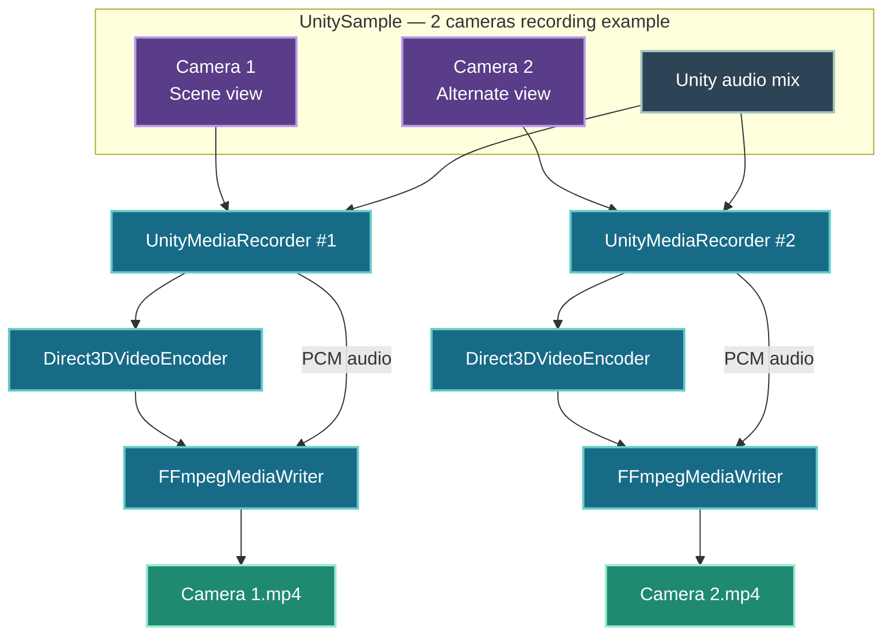

# Runtime Camera Recorder for Unity

So, what's it all about?

Picture this: you're playing your favorite game and think, “Hey, it'd be pretty cool to record my finest moments—but without the UI getting in the way.”

And while we're at it, why settle for one video? Why not record several at once, each from a different point of view?

That’s the whole idea behind **Runtime Camera Recorder for Unity**.

Give it one, two, or maybe three cameras, and it'll record their footage as efficiently as possible—without slowing down the runtime—the game.

# Current Support

| OS | GPU | Graphics API | Status |
| --- | --- | --- | --- |
| Windows x64 | NVIDIA GPU with NVENC | Direct3D 11 | ✅ Supported |
| Windows x64 | AMD | Direct3D 11 | 🔭 On the wishlist |
| Windows x64 | Intel | Direct3D 11 | 🔭 On the wishlist |
| Windows x64 | NVIDIA GPU with NVENC | Direct3D 12 | 🔭 On the wishlist |
| Linux | NVIDIA, AMD, or Intel | Vulkan | 🔭 On the wishlist |
| macOS | Apple silicon | Metal | 🔭 On the wishlist |

# Repositories

| Repository | Purpose |
| --- | --- |
| [UnityMediaRecorder](https://github.com/UnityRuntimeCameraRecorder/UnityMediaRecorder) | Records Unity cameras and screen output with audio. |
| [Direct3DVideoEncoder](https://github.com/UnityRuntimeCameraRecorder/Direct3DVideoEncoder) | Encodes Direct3D 11 textures using NVIDIA NVENC. |
| [FFmpegMediaWriter](https://github.com/UnityRuntimeCameraRecorder/FFmpegMediaWriter) | Combines encoded video and raw audio into MP4 files. |
| [UnitySample](https://github.com/UnityRuntimeCameraRecorder/UnitySample) | Demonstrates camera and screen recording in an editable Unity project. |

# UnitySample Architecture

# Contributing

Want to help move things off the wishlist? Contributions are more than welcome!

You can help by testing the recorder on your OS and GPU, then sharing your setup and performance results. Please include your OS, GPU model, Unity version, graphics API, and anything that worked—or didn't.

Feeling like writing some code? You can also help build support for the platforms, GPUs, and graphics APIs that aren't supported yet. Pick something from the wishlist, open an issue to discuss your approach, and let's make it happen.
