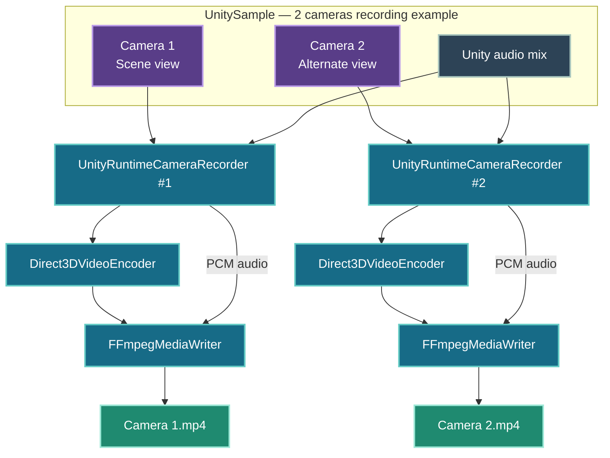
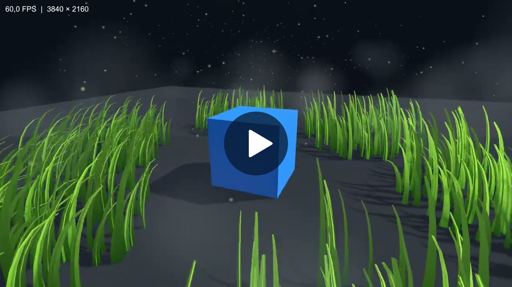
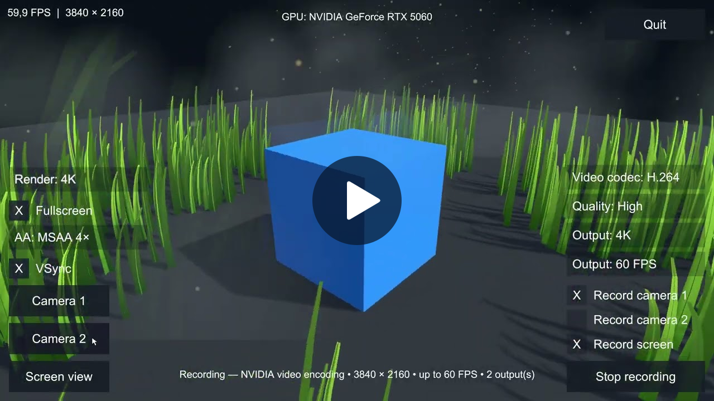
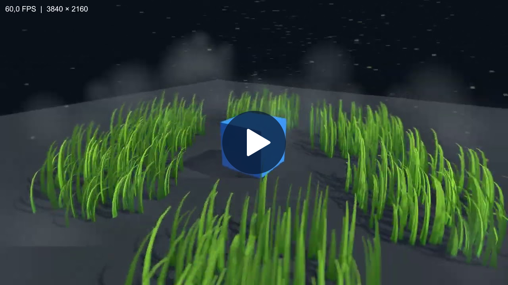
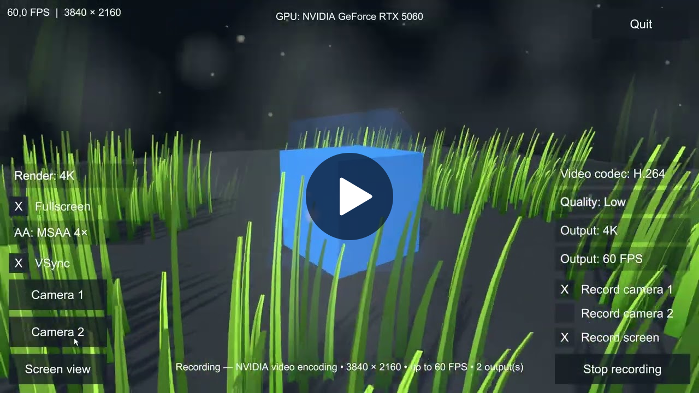
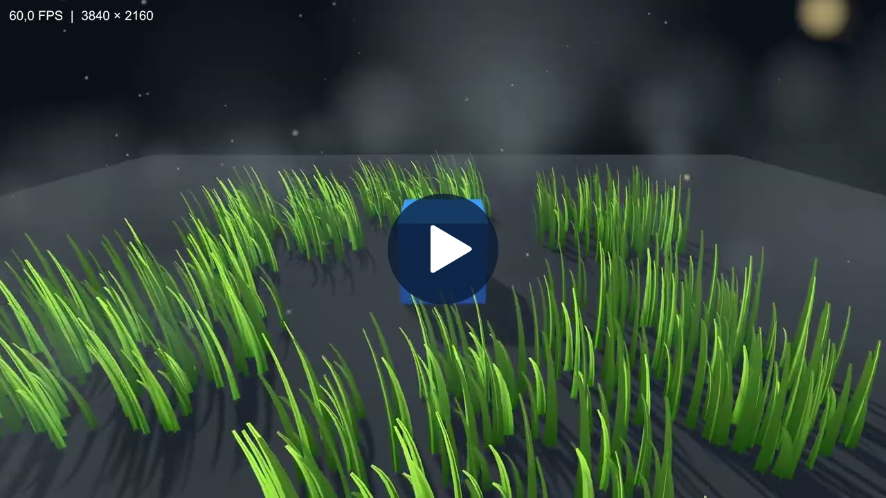

# Runtime Camera Recorder for Unity

So, what's it all about?

Picture this: you're playing your favorite game and think, “Hey, it'd be pretty cool to record my finest moments—but without the UI getting in the way.”

And while we're at it, why settle for one video? Why not record several at once, each from a different point of view?

That’s the whole idea behind **Runtime Camera Recorder for Unity**.

Give it one, two, or maybe three cameras, and it'll record their footage as efficiently as possible—without slowing down the runtime—the game.

# Current Support

| OS | GPU | Graphics API | Status |
| --- | --- | --- | --- |
| Windows x64 | NVIDIA GPU with NVENC | Direct3D 11 | ✅ Supported |
| Windows x64 | AMD | Direct3D 11 | 🔭 On the wishlist |
| Windows x64 | Intel | Direct3D 11 | 🔭 On the wishlist |
| Windows x64 | NVIDIA GPU with NVENC | Direct3D 12 | 🔭 On the wishlist |
| Linux | NVIDIA, AMD, or Intel | Vulkan | 🔭 On the wishlist |
| macOS | Apple silicon | Metal | 🔭 On the wishlist |

# Repositories

| Repository | Purpose |
| --- | --- |
| [UnityRuntimeCameraRecorder](https://github.com/UnityRuntimeCameraRecorder/UnityRuntimeCameraRecorder) | Records Unity cameras and screen output with audio. |
| [Direct3DVideoEncoder](https://github.com/UnityRuntimeCameraRecorder/Direct3DVideoEncoder) | Encodes Direct3D 11 textures using NVIDIA NVENC. |
| [FFmpegMediaWriter](https://github.com/UnityRuntimeCameraRecorder/FFmpegMediaWriter) | Combines encoded video and raw audio into MP4 files. |
| [UnitySample](https://github.com/UnityRuntimeCameraRecorder/UnitySample) | Demonstrates camera and screen recording in an editable Unity project. |

# Getting Started

Follow the [UnityRuntimeCameraRecorder Getting Started guide](https://github.com/UnityRuntimeCameraRecorder/UnityRuntimeCameraRecorder/blob/main/DEVELOPER_GUIDE.md) to integrate cameras, screen capture, textures, multi-source sequences, transitions, statistics and PNG capture step by step.

# UnitySample Architecture

# UnitySample Videos

These videos were recorded with the [UnitySample](https://github.com/UnityRuntimeCameraRecorder/UnitySample) application. The first three runs saved each selected camera as a separate video. The fourth run combined three selected sources into one video.

## First Run: 1 Camera Recording in High Preset

One camera was recorded with the High preset.

   
  <strong>Camera2</strong>

## Second Run: 2 Cameras Recording in High Preset

Screen Camera and Camera1 were recorded simultaneously with the High preset.

|  |  |
| :---: | :---: |
|  |  |
| **Screen Camera** | **Camera1** |

## Third Run: 2 Cameras Recording in Low Preset

Screen Camera and Camera1 were recorded simultaneously with the Low preset.

|  |  |
| :---: | :---: |
|  |  |
| **Screen Camera** | **Camera1** |

## Fourth Run: 3 Inputs to 1 Output

Camera1, Camera2, and Screen Camera were recorded into one automatically edited video.

   
  <strong>Camera1 + Camera2 + Screen Camera → 1 output</strong>

# 4K Performance Comparison

These measurements used an NVIDIA GeForce RTX 5060, H.264, 4K at 60 FPS, VSync, and MSAA 4x. The two-camera runs recorded Camera 1 and Screen as separate videos; the single-camera run recorded Camera 2. The fourth run combined Camera 1, Camera 2, and Screen Camera into one output. Video FPS was measured from second 1 through second 6.

| 
Metric
 | 
High (1&nbsp;camera)
 | 
Low (2&nbsp;cameras)
 | 
High (2&nbsp;cameras)
 | 
High (3&nbsp;inputs → 1&nbsp;output)
 | 
Note
 |
| --- | ---: | ---: | ---: | ---: | --- |
| Resolution | 3840 x 2160 | 3840 x 2160 | 3840 x 2160 | 3840 x 2160 | - |
| Target frame rate | 60 FPS | 60 FPS | 60 FPS | 60 FPS | - |
| VSync | Enabled | Enabled | Enabled | Enabled | - |
| Anti-aliasing | MSAA 4x | MSAA 4x | MSAA 4x | MSAA 4x | - |
| Video codec | H.264 | H.264 | H.264 | H.264 | - |
| NVENC preset | P5 | P4 | P4 | P5 | P5 improves compression efficiency and visual quality; P4 reduces GPU cost. |
| CQP | 16 | 27 | 16 | 16 | Low applies stronger video compression. High preserves more fine detail and produces fewer artifacts in grass, mist, particles, and fast motion. |
| AAC audio bitrate | 192 kbps | 128 kbps | 192 kbps | 192 kbps | Low applies stronger audio compression. High can sound cleaner, especially for music and complex audio; Low may introduce mild compression artifacts. |
| Spatial AQ | Enabled | Enabled | Enabled | Enabled | - |
| Temporal AQ | Enabled | Disabled | Disabled | Enabled | Disabled automatically for multiple videos to reduce GPU cost. |
| Lookahead | Enabled | Disabled | Disabled | Enabled | Disabled automatically for multiple videos to reduce GPU cost. |
| B-frames | 2 | 2 | 2 | 2 | - |
| Capture duration | 4 min 2 s | 4 min 2 s | 4 min 3 s | 0 min 37 s | - |
| Unity render FPS | 60 | 60 | 60 | 59.8 | - |
| Video FPS | 60 | 60 | 60 | 59.8 | - |
| Screen video FPS | - | 60 | 60 | - | - |
| Dropped frames | 0 / 14,502 | 1 / 14,541 | 2 / 14,574 | 0 / 2,225 | Negligible in all runs |
| Video file size | 3.62 GB | 1.52 GB | 5.10 GB | 0.63 GB | Two-camera High / Low size ratio: 3.4x. |
| Screen file size | - | 1.12 GB | 3.69 GB | - | Two-camera High / Low size ratio: 3.3x. |

All configurations maintained essentially 60 FPS. Low reduced the combined two-camera output size by about 70%.

# Contributing

Want to help move things off the wishlist? Contributions are more than welcome!

You can help by testing the recorder on your OS and GPU, then sharing your setup and performance results. Please include your OS, GPU model, Unity version, graphics API, and anything that worked—or didn't.

Feeling like writing some code? You can also help build support for the platforms, GPUs, and graphics APIs that aren't supported yet. Pick something from the wishlist, open an issue to discuss your approach, and let's make it happen.
